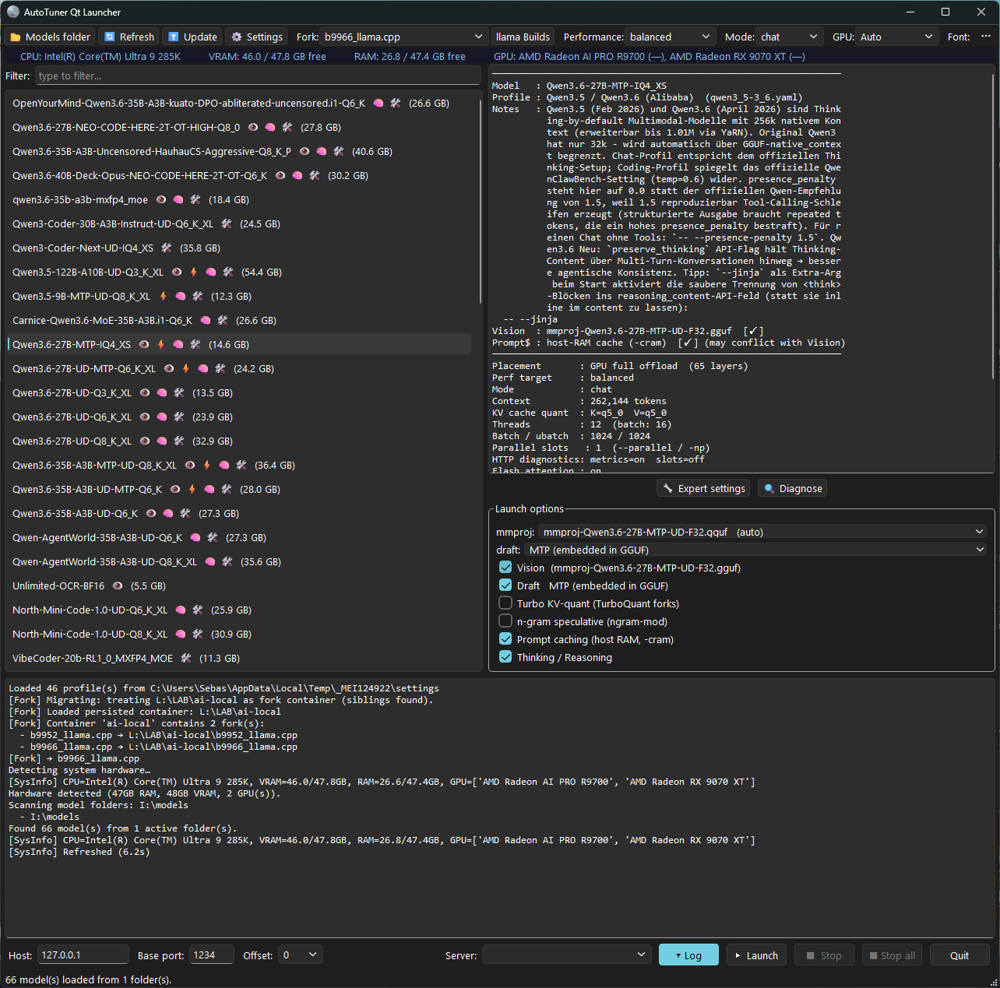

# AutoTuner for llama.cpp

Interactive launcher for `llama-server` that **detects your hardware**,
**scans your local GGUF collection**, and **auto-tunes** context length,
KV-cache quantization, GPU offload, threading, and batch size to fit in
the RAM/VRAM you actually have free — without manual edits.

# GUI-Design



## Features

- **Interactive terminal menu** — pick from whatever GGUFs are in your
  models folder, no editing required.
- **Visible throughput logs** — AutoTuner emits `--perf` on current
  llama.cpp builds so the separate terminal keeps showing prompt/eval
  timings and tokens/s; append `--no-perf` if you want quieter logs.
- **Hardware auto-detection** — works on **AMD (ROCm)**, **NVIDIA**,
  **Intel**, and **Apple Silicon** (unified memory). Multi-GPU is
  supported via automatic `--tensor-split`. The split strategy depends on
  the model type:
  - **Dense** models use a **priority-weighted** split: a model that fits
    the largest card is pinned to it (the second GPU stays free for
    gaming/OBS); larger models put the bulk of the weights on the
    high-priority card.
  - **MoE** models that don't fit the primary card alone use a
    **capacity-fill** split instead — both GPUs are packed to roughly the
    same utilisation so the maximum number of expert layers stays resident
    in VRAM (every expert that lands on the GPU instead of spilling to CPU
    via `--n-cpu-moe` is a real speed win). This replaces the old
    priority-weighted behaviour for MoE, which stranded several GB on the
    secondary card and slowed the model down.

  Device visibility is pinned via `HIP_VISIBLE_DEVICES` *and*
  `GGML_VK_VISIBLE_DEVICES` so it works on both ROCm and Vulkan builds.
- **Free-memory aware** — context length and KV quant are picked to
  use the RAM/VRAM that's actually free *right now*, not a hard-coded
  cap. The original v1 cap of 16k context is gone.
- **Per-family YAML profiles** in `settings/` — override sampling,
  max context, chat template, and llama-server flags per model family.
  Easy for contributors to extend without touching Python.
- **Companion-file auto-pairing** — sibling files don't pollute the
  model menu, they're attached to their main model:
  - `mmproj` projectors → vision (longest-prefix wins). The `mmproj`
    marker is detected **anywhere in the filename**, not just as a
    leading `mmproj-` prefix — so a projector named with the marker
    mid-name (e.g. `qwen3.6-35b-a3b-mxfp4-moe-mmproj-f16.gguf`, where the
    vendor put the quant label before `mmproj`) is now paired correctly.
    Projectors saved with a literal **`.mmproj` extension** (some audio
    projectors) are picked up too, even though they don't match the
    `*.gguf` glob. Matching is separator-tolerant (`-moe` vs `_moe` no
    longer blocks a pair) but still size-specific, so a 2B model never
    grabs a 0.8B projector. When a model ships **several projector
    precisions** side by side (`…-bf16`, `…-f16`, `…-f32`), all are kept
    as candidates and a **dropdown** in the Launch options lets you switch
    between them. The auto pick prefers the **highest precision**
    (f32 > f16 > bf16) on an otherwise-equal name match; your manual
    choice is remembered per model.
  - `*-assistant-*.gguf` / `*-draft-*.gguf` → speculative decoding
      (smallest matching sibling wins)
- **Capability badges in the model list** — symbols make it obvious
  what each model can do at a glance:
  - 👁 vision (mmproj projector paired)
  - ⚡ draft  (assistant sibling for speculative decoding)
  - 🧠 thinking (chat template emits `<think>` / `reasoning_content`)
  - 🛠 tool-use (chat template advertises `tool_calls` / `function_call`)

  Detection reads the GGUF chat template directly — no name-based
  guessing — so `Qwen3-Coder` (no thinking) and `Qwen3-Embedding`
  (neither thinking nor tools) are correctly excluded.
- **Reads GGUF metadata** — pulls `n_layers` and `context_length`
  straight from the file so partial GPU offload (`-ngl`) is exact.
- **Author-recommended samplers from GGUF metadata** — many models embed
  their recommended sampler defaults in `general.sampling.*`
  (e.g. Qwen3.5/3.6 ship `temp 1.0 / top_k 20 / top_p 0.95`). The tuner
  now reads these and uses them to fill any sampling value a matched YAML
  profile leaves unspecified. Priority per field is: a **matched family
  profile's explicit value** wins first (these are hand-tuned), then the
  **GGUF recommendation**, then the generic default. The practical effect:
  a model with **no tailored profile** (so it would otherwise fall back to
  the generic `temp 0.7 / top_k 40`) now runs on its intended samplers —
  a frequent cause of repetition loops and broken tool-calls on models
  tuned for a low `top_k` with a non-zero `min_p`.
- **Multi-server (run several models at once)** — Launch no longer
  refuses while a server is running. Each new model gets the **next free
  port**: 0 servers → `1234`, 1 → `1235`, 2 → `1236`, … When a server is
  stopped or exits, its port is reclaimed and the counter effectively
  **resets** (the next launch reuses the freed port). The status bar shows
  how many servers are live; **Stop** stops the most recent one.
- **GPU load-balancing for the 2nd/3rd model** — before launching an
  *additional* model the AutoTuner **re-reads live VRAM** (so it sees what
  the already-running models actually hold) and steers the new model onto
  the **emptier card** via `HIP_VISIBLE_DEVICES` / `GGML_VK_VISIBLE_DEVICES`.
  If **no GPU has room** it **refuses with a clear message** instead of
  piling everything onto a card that's already full (e.g. an R9700 sitting
  at 31/32 GB). The *first* model still uses the normal automatic
  multi-GPU split.
- **Host-memory prompt caching (`--cache-ram` / `-cram`)** — auto-enabled
  for **every model that supports it** (i.e. every non-vision model),
  with a Launch-options toggle to turn it off. Cached prompt prefixes live
  in system RAM and are hot-swapped back when a new request shares a long
  prefix (system prompt, RAG scaffold, Roo-Code preamble), collapsing
  time-to-first-token on repeated prompts. It is **force-disabled for
  vision models** because the feature is incompatible with the multimodal
  (`mtmd`) path in llama-server — the toggle greys out and the preview
  says so. Default cap is `-1` (no byte limit; uses available RAM).
- **Sticky GUI choices** — the Qt launcher remembers per-model
  vision / draft / thinking / **n-gram** / **prompt-cache** toggles **and
  the chosen mmproj projector** in `autotuner_settings.json`. Switch to
  another model and back, restart the app, change the performance
  target — your manual choices stay put. They only revert when you
  click them again.
- **Fork-folder memory** — if you point the GUI at a parent folder
  that holds several `*_llama.cpp` builds (e.g. `C:\LAB\ai-local`),
  the next launch re-expands the same set of builds in the dropdown.
  No more re-navigating one folder up after every restart.
- **Window geometry, state & inner layout** — QMainWindow
  `saveGeometry()` (size, position, maximize-state) and `saveState()`
  (toolbars/docks) are persisted as base64 in the settings JSON. **In
  addition, each inner `QSplitter` saves its own handle positions** under
  a stable object name, so the *arrangement of the panes inside the
  window* (model-list vs config width, and the log-panel height) is
  restored too — not just the outer window size. `saveState()` alone does
  not round-trip plain central-widget splitters, hence the separate
  per-splitter persistence.
- **Global font size** — persistent font size (clamped 7..22), applied
  immediately on app start (no flash of the default).
- **Application settings** — the **⚙ Settings** toolbar button (also available
  in the Windows title-bar system menu) controls per-user login autostart on
  Windows, Linux, and macOS, plus optional **X → notification area/system
  tray** behavior. Both options are disabled by default; the tray menu and the
  dedicated **Quit** button always exit normally.
- **Reasoning effort** — selectable per model: `auto` / `off` /
  `minimal` / `low` / `medium` / `high` / `extra_high`. Think-budget
  (spin-box, -1 = off, 0 = stop immediately, N = token budget) in the
  Expert panel.

### Vision control

You can disable vision (mmproj) support in two ways:

1. **Command-line flag**:

   ```bash
   python auto_tuner.py --model "Qwen3.6" --novision
   ```

2. **GUI checkbox** in *Launch options*. When the model ships several
   projector precisions (`…-bf16` / `…-f16` / `…-f32`), an **mmproj
   dropdown** appears above the checkboxes so you can pick which one to
   load. The chosen projector is remembered per model in
   `autotuner_settings.json` under `mmproj_selection`. The auto pick
   defaults to the highest precision available.

> **Note on prompt caching + vision:** host-memory prompt caching
> (`--cache-ram`) is **incompatible with the multimodal path** in
> llama-server. Whenever vision is active the AutoTuner emits
> `--cache-ram 0` and the GUI's *Prompt caching* checkbox greys out.

## Installation

```bash
git clone https://github.com/DaWasteh/Auto-Tuner.git
cd "Auto-Tuner"
pip install -r requirements.txt
```

You also need a working `llama-server` binary. The tuner automatically discovers binaries in common local setups (like `C:\LAB\ai-local\`), or you can specify one via `--server`.

## Update (GUI-Button oder Terminal)

In der Qt-GUI gibt es oben in der Toolbar den Button **⬆ Update**. Er
prüft GitHub auf neue AutoTuner-Versionen. In einem echten `git clone` nutzt
er `git pull --ff-only`; in einem heruntergeladenen ZIP/Release-Ordner ohne
`.git` lädt er automatisch das aktuelle GitHub-Source-ZIP herunter und spielt
es über die bestehende Installation. Bei geänderter `requirements.txt` führt
er automatisch `pip install -r requirements.txt` aus. Vor dem Update wird
`autotuner_settings.json` gesichert und danach wiederhergestellt — deine
lokalen Pfade, Ports, Overrides und UI-Einstellungen werden also nicht
überschrieben (auch bei älteren Klonen, in denen die Datei noch versehentlich
von Git getrackt wird). Nach einem erfolgreichen Update AutoTuner neu starten.

Danke für die Update-Button-Idee an [nextscript](https://github.com/nextscript).

Wenn du AutoTuner per `git clone` installiert hast, kannst du neue Versionen
weiterhin über das Terminal holen. Deine persönlichen Einstellungen bleiben
auch dabei erhalten, solange `autotuner_settings.json` lokal ignoriert ist.

**1. In den App-Ordner wechseln** (dorthin, wo du geklont hast):

```bash
cd "H:/GitHub/Auto Tuner"
```

**2. Aktuelle Änderungen herunterladen:**

```bash
git pull
```
Falls du lokal an den Python-Dateien herumgepfuscht hast und `git pull`
mit einem Konflikt abbricht, kannst du deine lokalen Änderungen
verwerfen und den Upstream-Stand übernehmen:

```bash
git stash            # lokale Änderungen kurz beiseite legen
git pull
git stash drop       # beiseite gelegte Änderungen verwerfen
# oder: git stash pop  → Änderungen wiederherstellen (evtl. Konflikte lösen)
```

> ⚠️ In aktuellen Klonen ist `autotuner_settings.json` gitignored; `git stash`
> berührt sie dann nicht. Wenn dein alter Klon die Datei noch als geändert
> anzeigt, nutze bevorzugt den **⬆ Update**-Button — er sichert und restored
> die Datei explizit.

**3. Abhängigkeiten aktualisieren** (nur nötig, wenn sich `requirements.txt`
geändert hat — schadet aber nie):

```bash
pip install -r requirements.txt
```
Falls du eine virtuelle Umgebung nutzt, aktiviere sie vorher. Projekt-Konvention:
Windows nutzt `.venv`, Ubuntu/Linux nutzt `.venv_linux`.

```bash
# Ubuntu/Linux
python3 -m venv .venv_linux
.venv_linux/bin/python -m pip install -r requirements.txt
source .venv_linux/bin/activate
```

```bat
REM Windows
py -m venv .venv
.venv\Scripts\activate
pip install -r requirements.txt
```

**4. App starten** — danach einfach wie gewohnt:

```bash
python qt_launcher.py        # GUI
# oder
python auto_tuner.py         # Terminal
```

**Kurzform** (wenn sich nichts an den Abhängigkeiten geändert hat):

```bash
git pull && python qt_launcher.py
```

## Compiled build (.exe / Linux binary)

Für Einsteiger gibt es eine kompilierte **noconsole**-Version — keine
Python-Installation, kein Terminalfenster, einfach Doppelklick. Sie läuft auf
**Windows 10/11** (`.exe`) und **Ubuntu** (Linux-Binary) und lässt sich über
denselben **⬆ Update**-Button self-updaten.

### Bauen

PyInstaller kann nicht cross-kompilieren — die `.exe` wird **auf Windows**
gemacht, der Linux-Binary **auf Linux**. Beide landen als Assets im selben
GitHub-Release.

```bash
# einmalig im Build-Environment:
python -m pip install pyinstaller
python -m pip install -r requirements.txt

# dann das jeweilige Binary bauen:
python build_exe.py
# → Windows: dist/AutoTuner.exe   |   Linux: dist/AutoTuner-Linux
```

`build_exe.py` bündelt `settings/*.yaml` und das App-Icon aus `assets/` als
read-only Daten mit; unter Windows wird `assets/AutoTuner.ico` zusätzlich in
die `.exe` eingebettet. Nutzer-State (`autotuner_settings.json`, Logs) liegt
persistent neben dem Binary und bleibt bei Updates erhalten.

### Release / Auto-Update

1. `autotuner_version.py` → `VERSION` hochzählen (z. B. `"1.1.0"`).
2. Commit + Tag **`v1.1.0`** (das Tag-Format `v<VERSION>` ist Pflicht — der
   Updater streift das führende `v` vor dem Vergleich).
3. Ein GitHub-Release mit Tag `v1.1.0` erstellen und **beide** Assets hochladen:
   `AutoTuner.exe` (Windows) und `AutoTuner-Linux` (Linux).
4. Der Update-Button in der kompilierten Version holt sich automatisch das
   zum laufenden OS passende Asset, lädt es herunter und tauscht das Binary
   über einen Swap-Shim nach Neustart aus (Windows sperrt die laufende `.exe`,
   deshalb der Shim; auf Linux geht das direkte `mv` über das laufende ELF).

> Source-Installationen (Entwickler) nutzen weiterhin den git/ZIP-Updater; die
> kompilierte Version wählt automatisch den Binary-Swap-Pfad (`sys.frozen`).

## Usage

Point it at a folder of `*.gguf` models — it will recurse:

```bash
python auto_tuner.py --models-path /path/to/models
```

Or set the environment variable once:

```bash
export AUTOTUNER_MODELS=/path/to/models     # Linux / macOS
setx  AUTOTUNER_MODELS  D:\models           # Windows
python auto_tuner.py
```

Pick a model from the menu. Once it's running, point your client at:

```
http://127.0.0.1:1234
```

Works with the built-in **llama.cpp Web UI**, **VS Code** extensions
like Continue / Cline, **Open WebUI**, or any OpenAI-API client.

### Qt GUI

```bash
python qt_launcher.py
```

Same engine as the terminal launcher, plus a few quality-of-life bits
that only make sense with persistent state:

- **Sticky per-model options.** Toggle vision / draft / thinking /
  n-gram / prompt-cache once, and pick an mmproj precision from the
  dropdown; the choices survive switching to another model and back,
  swapping performance targets, and restarting the app. Stored in
  `autotuner_settings.json` under `model_overrides` and `mmproj_selection`.
- **Expert settings are saved per model (autosave).** Every edit you make
  in the Expert panel — Auto-cascade pins *or* a full Manual setup — is
  debounced-saved under `expert_overrides` keyed by model name and applied
  automatically the next time you select that model (just like the
  checkbox overrides above), so a low-VRAM hand-tuning never has to be
  re-entered. Auto-mode saves adapt to the current VRAM on launch
  (re-cascaded from the saved pins); Manual-mode saves are applied as the
  exact frozen values (the launch VRAM fit-check still gates them). The
  **⟲ Reset** button next to *Auto* / *Manual* drops the saved state for
  the current model and reloads the AutoTuner's automatically-best config.
- **Run several models at once.** Launch stays enabled while servers are
  running — each new model is placed on the **emptier GPU** and given the
  **next free port** (1234, 1235, 1236, …). Stop a server and its port is
  freed for the next launch. If no card has room, the GUI tells you
  instead of overcommitting a full GPU.
- **GPU pin dropdown (toolbar → *GPU*).** Click-path equivalent of the
  CLI `--gpu` flag: choose **Auto** for the usual free-VRAM-aware
  selection, or pick a card by name to **hard-pin** the next launch to it
  and hide the others. The card list is filled from detected hardware, so
  it shows your actual GPUs (e.g. *R9700*, *9070*) rather than fixed
  labels. Use it to force a second server onto the still-empty card
  instead of letting it pile onto the busy one. The choice is persisted as
  `forced_gpu` in `autotuner_settings.json` and feeds the same
  `compute_config(force_gpu=…)` path as the CLI flag, so the config
  preview updates the instant you change it.
- **Fork picker remembers the parent folder.** Hit *📂 Fork* and
  pick a directory that holds multiple `*_llama.cpp` builds — every
  build appears in the dropdown next time too, not just the last one
  you used. The active build within that container is also restored.
- **Live config preview.** The right pane recomputes
  context / KV / placement whenever you tick a checkbox or change the
  performance target — no need to launch first.
- **Honest load status (`/health` handshake).** After launch the status
  bar shows *Loading model* and only flips to *Ready* once the server's
  `GET /health` returns 200. Big MoE models can take a while to load (or
  fail mid graph-build) — the GUI no longer claims "Running" the instant
  the PID exists. A crash during load is surfaced as *Server exited*.
- **Window geometry + inner layout persistence.** Window size, position,
  maximize-state and toolbar status are saved, **and** the inner pane
  arrangement (model-list vs config width, log-panel height) is restored
  via each splitter's own `saveState()` — not just the outer window.
- **Font persistence.** The global QApplication font size is persisted
  and applied immediately on start (`_change_font`). No more flash of the
  default font size.
- **Reasoning panel (Expert panel).** New section with:
  - Dropdown "Effort": `auto` / `off` / `minimal` / `low` /
      `medium` / `high` / `extra_high`
  - SpinBox "Think budget": `-1` = off, `0` = stop immediately, `N` =
      token budget
  The values are translated into `--reasoning`, `--reasoning-budget` and
  `--chat-template-kwargs` in `cfg.extra_cli_flags`.

### Useful flags

| Flag | Description |
|---|---|
| `--models-path PATH` | Folder to scan (default `./models`, env `AUTOTUNER_MODELS`) |
| `--settings-path PATH` | Folder with YAML profiles (default `./settings`) |
| `--server PATH` | Path to `llama-server` (default looks on `$PATH`, env `LLAMA_SERVER`) |
| `--host HOST` | Bind address (default `127.0.0.1`) |
| `--port N` | Server port (default `1234`). In the GUI this is the **base** port; each additional concurrent server gets the next free one (1235, 1236, …) |
| `--ctx N` | Override the auto-tuned context length |
| `--model SUBSTR` | Skip the menu, pick a model by name substring |
| `--gpu NAME` | Hard-pin the server to a single GPU by name substring (e.g. `--gpu 9070`, `--gpu R9700`). Overrides the persisted `forced_gpu`; omit for free-VRAM-aware auto selection. The GUI exposes the same pin via the toolbar **GPU** dropdown |
| `--ngram` | Enable n-gram (ngram-mod) self-speculative decoding |
| `--no-prompt-cache` | Disable host-memory prompt caching (`--cache-ram 0`). Caching is auto-on for non-vision models by default; always off for vision models |
| `--dry-run` | Print the command, don't start the server |
| `--yes / -y` | Skip the launch confirmation prompt |
| `--force-mlock` | Force `--mlock` / `--no-mmap` (prevents VRAM/RAM paging) |
| `--performance-target {safe,balanced,throughput,low_vram}` | VRAM utilisation preset (see below) |
| `-- <args...>` | Anything after `--` is forwarded to `llama-server` |

### Performance targets (`--performance-target`)

A single switch that controls how aggressively the AutoTuner reserves
VRAM. It changes both the safety bands and the KV-cache budget that
gets reserved up front during MoE layer placement, so picking the right
tier can move several expert layers between GPU and CPU.

| Tier | KV reservation | VRAM safety | When to use |
|---|---|---|---|
| `safe` | 128 k tokens | 0.30 GB | Long-context sessions (>64 k), maximum stability |
| `balanced` *(default)* | 64 k tokens | 0.25 GB | General use — moderate optimisation that helps everyone |
| `throughput` | 32 k tokens | 0.15 GB | Short-context inference (chat, reasoning ≤32 k); pushes more expert layers onto the GPU for higher tokens/s |
| `low_vram` | KV → system RAM | 0.15 GB | **LOW-VRAM / high-RAM boxes** (e.g. 8 GB VRAM, 64 GB RAM). Forces the KV cache into system RAM via `--no-kv-offload`, so context is drawn from abundant RAM instead of scarce VRAM — the only way to reach 90 k+ on a 20 GB MoE that barely fits the GPU. Trades generation speed for context (attention compute follows the KV onto the CPU). |

#### Why `low_vram` exists

On a GPU too small to hold both a MoE model's expert weights **and**
its KV cache, the leftover VRAM after expert placement throttles context
to a few thousand tokens — useless for agentic coding, which typically
needs 90–130 k. The other tiers keep the MoE KV cache in VRAM (the
Vulkan backend asserts when MoE KV spills to RAM mid-split), so they
cannot help here. `low_vram` sidesteps the whole problem by telling
llama.cpp to keep the **entire** KV cache in system RAM
(`--no-kv-offload`); the model's 64 GB of RAM becomes the context
budget instead of the ~1 GB of leftover VRAM. Experts still run on the
GPU where they fit (`--n-cpu-moe`), so only attention is paid for in
speed. Opt-in only — `safe`/`balanced`/`throughput` are completely
unaffected.

**Resolution priority** (highest wins): explicit CLI flag → GUI dropdown
→ `performance_target:` in the model's YAML profile → `balanced` default.
Unknown values are silently ignored, so a typo in a YAML never breaks
anything.

A profile can declare its preferred tier in YAML:

```yaml
# settings/qwen3_5-3_6.yaml
performance_target: throughput   # MoE — wants every spare GB on the GPU
```

The user choice (CLI / GUI) always wins over the profile recommendation.

### Memory locking (`--mlock` / `--no-mmap`)

The auto-tuner automatically decides whether to enable `--mlock` and `--no-mmap`
based on available system resources. These flags pin model data in physical
memory (RAM/VRAM) and prevent the OS from paging it to disk, which is critical
for stable inference performance.

**Automatic behavior:**

| Scenario | Condition | Result |
|---|---|---|
| **Full GPU offload** | `total_vram > 8 GB` AND `free_vram > model_size + 2 GB` | `--mlock --no-mmap` enabled |
| **Partial / CPU offload** | `total_ram > 32 GB` AND `free_ram > model_ram_on_cpu + 8 GB` | `--mlock --no-mmap` enabled |
| **Insufficient memory** | Safety reserve not met | Disabled (fallback to default mmap) |

**Force memory locking:**

Use `--force-mlock` to override the automatic decision and always enable
memory locking when the OS permits it:

```bash
python auto_tuner.py --force-mlock
```

This is useful when you know your system has enough memory but the tuner's
conservative thresholds would otherwise skip it.

**Debug output:**

The tuner prints the mlock decision before every launch:

```
  [mlock] decision: model=Qwen3.6-35B-A3B-UD-Q6_K
         full_offload=True  vram=18.5GB  ram=0.0GB
         sys: total_vram=24.0GB  free_vram=5.2GB  total_ram=32.0GB  free_ram=12.1GB
         force_mlock=False  -> mlock=True  no_mmap=True
```

### Environment variables

| Variable | Default | Purpose |
|---|---|---|
| `AUTOTUNER_MODELS` | `./models` | Where to scan for `*.gguf` files |
| `LLAMA_SERVER` | `llama-server` | Path or name of the server binary |
| `LLAMA_CPP_DIR` | (auto-detected) | Your llama.cpp checkout. If set, the auto-tuner will look for `build/bin/[Release/]llama-server[.exe]` inside it. |

### Server binary auto-discovery

The tuner automatically searches for binaries in common local layouts.
If you have a workspace like this, it "Just Works" without any flags:

```
H:\GitHub\
└── Auto Tuner\         ← clone of this repo
H:\LAB\
└── ai-local\
    ├── llama.cpp\      ← standard build
    ├── tq_llama.cpp\   ← Turbo-Quant build
    ├── ik_llama.cpp\   ← Gemma 4 external drafter (fork still needed)
    └── 1b_llama.cpp\   ← BitNet fork (Ternary-Bonsai)
I:\
└── models\             ← your models
```

It looks for `llama-server` inside these directories (including `build/bin/...` subpaths).

#### Quantization Modes

When you start the tuner, you can choose between:

1. **Standard-Quant**: Uses standard `llama.cpp` binaries.
2. **Turbo-Quant**: Uses the `tq_llama.cpp` binary for faster inference.

#### Turbo-Quant labels & KV-quant options

`kv_quant_factor()` now supports the following Turbo-Quant labels:
`turbo2`, `turbo3`, `turbo4`, `iq4_nl`, `tq3_0`, `turbo3_tcq`.

`_TURBO_QUANT_MAP` corrects the real labels:

| Label   | Turbo-Quant | Factor (vs F16) |
|---------|-------------|-----------------|
| `q8_0`  | `turbo4`    | ~3.8x           |
| `q5_0`  | `turbo3`    | ~4.3x           |
| `q4_0`  | `turbo3`    | ~4.3x           |

(It previously mapped incorrectly to `q4_1`/`q5_1`, which are mainline
labels, NOT TurboQuant.)

`_pick_kv_quant` now computes the budget with the Turbo factors — when you
switch, the real token-count increase shows up (measured: 48k → 63k on
Qwen3.6-35B-A3B).

The KV dropdowns in the GUI show the full selection: `iq4_nl`,
`q4_1`, `q5_1`, `turbo2`, `turbo3`, `turbo4`.

#### Specialized Binary Logic

The tuner intelligently selects the best binary based on your model and settings:

- **Gemma 4 (with external draft)** $\rightarrow$ uses `ik_llama.cpp` (external sibling drafter still requires the fork).
- **Gemma 4 (without draft)** $\rightarrow$ uses standard `llama.cpp`.
- **Integrated MTP (e.g. Qwen3.6-27B-MTP)** $\rightarrow$ uses standard `llama.cpp` (native since b9190+; PR #22673 in mainline since 16 May 2026; no fork needed).
- **Ternary-Bonsai** $\rightarrow$ uses `1b_llama.cpp`.
- **Turbo-Quant Mode** $\rightarrow$ uses `tq_llama.cpp`.

Example — run Devstral, override context, and pass an extra flag
(`--metrics` is enabled by default, so this just shows pass-through):

```bash
python auto_tuner.py --model Devstral --ctx 131072 -y -- --verbose
```

## Adding profiles for new models

Drop a new YAML file into `settings/`. The filename doesn't matter;
the `patterns:` list does. The longest pattern that appears as a
substring of the model filename wins.

```yaml
# settings/my-model.yaml
display_name: "My Model"
patterns:
  - my-model
  - my-model-base

max_context: 131072
recommended_kv_quant: q8_0

sampling:
  temperature: 0.7
  top_k: 40
  top_p: 0.9
  min_p: 0.05
  repeat_penalty: 1.05

# Optional:
chat_template: chatml
extra_args:
  - --no-context-shift
notes: >
  Anything you want to remind yourself about this model.
```

Profiles with empty `patterns:` become the fallback when nothing else
matches. See `settings/_default.yaml`.

**Profiles currently bundled** (arch string read from GGUF metadata):

| Profile file | Models | llama.cpp arch |
|--------------|--------|----------------|
| `gemma-4.yaml` | Gemma 4 E2B/E4B/**12B**/26B-A4B/31B | `gemma4` |
| `mellum.yaml` | JetBrains Mellum2-12B-A2.5B (Base/Instruct/Thinking), MoE | `mellum` |
| `exaone-4_5.yaml` | LG EXAONE 4.5 33B VLM (dense, non-commercial license) | `exaone4` |
| `step35.yaml` | StepFun Step 3.5 Flash + Step 3.7-Flash (MoE ~196–198B/11B, MTP-3) | `step35` |
| `granite-embedding-r2.yaml` | IBM Granite Embedding Multilingual R2 97m/311m (**embedding**, not chat) | `modern-bert` |

Notes on the new profiles:

- **Mellum 2** is a code-focused MoE (64 experts, 8 active; 12B total /
  2.5B active; 128k ctx). `ngram_method` is deliberately set to
  `ngram-map-k4v` (MTP-compatible) so it survives whether or not llama.cpp's
  `mellum` loader executes JetBrains' MTP head.
- **EXAONE 4.5** is a dense 33B VLM. Its integrated MTP/NextN tail blocks are
  *loaded but not executed* by llama.cpp (b9500, same as `exaone-moe`), so the
  profile uses draftless `ngram-mod`, not `draft-mtp`. License is
  non-commercial (research/academic only).
- **Step 3.5 / 3.7-Flash** both load under `step35` and both carry a real
  MTP-3 head (`num_nextn_predict_layers`), so the profile pairs
  `draft-mtp` + `ngram-map-k4v` with `draft_max: 3`. ⚠️ At ~196–198B MoE
  these exceed this machine's 48 GB (VRAM+RAM) — realistically need heavy
  `--n-cpu-moe` offload or are not runnable; the profile is for
  correctness/future smaller builds.
- **Granite Embedding R2** is an *embedding* model — it runs as an embedding
  endpoint (`--embeddings --pooling cls`, set via `extra_args`), not a
  chat/completion model. Sampling/draft fields are inert in that mode.

## How the auto-tuning works

1. **Detect**: total / free RAM, every GPU's total / free VRAM, total
   CPU cores.
2. **Place the model**: full GPU offload if it fits, else partial
   offload using the GGUF's exact `n_layers`, else CPU only.
3. **Compute the KV budget**: free VRAM (after the model) plus free
   RAM (minus a safety reserve).
4. **Pick KV quant + context**: try q8 → q5 → q4, pick the highest
   quality that fits the profile's `max_context`. Round context down
   to a multiple of 1024.
5. **Threads / batch**: scale with placement (full GPU offload needs
   fewer CPU threads than CPU-only inference; long context wants
   smaller batches to keep prompt-prefill memory bounded).
6. **Multi-GPU**: a model that fits the largest card alone is pinned to
   it (other GPUs hidden via the visibility env vars, so they stay free
   for gaming/OBS); larger models spread across all GPUs with a
   **priority-weighted** `--tensor-split` (priority × free VRAM), and the
   highest-scoring card becomes `--main-gpu`.
7. **Hand authority to the AutoTuner**: `--fit off` is always emitted so
   llama.cpp's own auto-fit pass never silently re-tunes the values the
   AutoTuner computed and logged. An overcommit fails loudly (OOM) instead
   of being quietly downscaled.

## Project layout

```
auto_tuner/
├── auto_tuner.py        # main entry: terminal menu + glue
├── qt_launcher.py       # Qt GUI (model picker + sticky options + fork picker)
├── hardware.py          # CPU + multi-vendor GPU detection
├── scanner.py           # GGUF scanner: mmproj/draft pairing, capability detection
├── settings_loader.py   # YAML profile loader and matcher
├── tuner.py             # config calculation + llama-server command builder
├── launcher.py          # subprocess + Ctrl+C handling (Windows + Unix)
├── app_settings.py      # persistent GUI prefs (autotuner_settings.json)
├── startup_manager.py   # Windows/Linux/macOS login autostart integration
...
├── settings/
│   ├── _default.yaml
│   ...
│   ├── ministral.yaml
│   ├── bonsai.yaml
│   ...
├── requirements.txt
└── README.md
```

## Building llama.cpp and forks

AutoTuner ships **launch logic**, not a bundled llama.cpp binary. Put your
`llama-server` / fork build in one of the configured build folders (GUI:
**llama Builds**, or `LLAMA_CPP_DIR`) and AutoTuner discovers it. The
repo keeps the build recipes in separate scripts so this README stays short:

| File | Purpose |
|------|---------|
| [`llama_build.txt`](llama_build.txt) | Mainline llama.cpp Vulkan build (Windows/AMD-friendly; versioned `bXXXX_llama.cpp`). |
| [`turboquant_llama_build.txt`](turboquant_llama_build.txt) | TurboQuant KV-cache fork (`tq_bXXXX_llama.cpp`). |
| [`ternary_bonsai_llama_build.txt`](ternary_bonsai_llama_build.txt) | PrismML Ternary/Bonsai fork (`2b_bXXXX_llama.cpp`), including the old-fork OpenSSL workaround. |
| [`diffusion_llama_build.txt`](diffusion_llama_build.txt) | DiffusionGemma PR build with Vulkan. |
| [`diffusion_hip_llama_build.txt`](diffusion_hip_llama_build.txt) | DiffusionGemma HIP/ROCm build for AMD when Vulkan hits the ~1 GiB single-allocation limit. |
| [`setup_llamacpp_cuda.ps1`](setup_llamacpp_cuda.ps1) | Windows NVIDIA/CUDA one-shot setup helper (PowerShell/Admin; freak288-style script). |
| [`setup_llamacpp_turboquant_cuda.ps1`](setup_llamacpp_turboquant_cuda.ps1) | Windows NVIDIA/CUDA TurboQuant setup helper. |

The `*.txt` build recipes are PowerShell commands for the documented local
workspace (`H:/LAB/ai-local` by default). They now handle both llama.cpp UI
layouts automatically (`tools/ui` since b9174, `tools/server/webui` on older
forks) and fall back to the prebuilt UI if the fork does not ship UI sources.

Ubuntu/Linux users can either build upstream llama.cpp normally or adapt the
same CMake flags from the recipes. The only AutoTuner requirement is that the
resulting binary is discoverable, e.g. `LLAMA_CPP_DIR=/opt/ai-local/b9888_llama.cpp`
with `build/bin/llama-server` inside.

## Server features (as of b9888)

The following `llama-server` features are supported (verified against `llama-server --help` / `tools/server/README.md`):

| Flag | Support |
|------|---------|
| `-fa [on\|off\|auto]` | ✅ Emits the `-fa on` form |
| `-ctk/-ctv f16/q8_0/q4_0/q4_1/q5_0/q5_1/iq4_nl` | ✅ All in the dropdown |
| `--fit off` | ✅ Always emitted so llama.cpp's own auto-fit pass (default `on`) doesn't silently re-adjust the computed values (AutoTuner is the authority) |
| `--perf` | ✅ Explicitly emitted so llama.cpp b9888 prints prompt/eval timings and tokens/s in the terminal again. Users can still append `--no-perf` to quiet it. |
| `--metrics` | ✅ Prometheus endpoint `GET /metrics` on the same host:port (see "Monitoring") |
| `--cache-ram` / `-cram` | ✅ Host-memory prompt caching (PR #16391). Auto-on (`-1`, unlimited) for every **non-vision** model, switchable off via GUI checkbox. **Forced `0` for vision models** (incompatible with the mtmd path) |
| `--reasoning on/off/auto` | ✅ Via dropdown |
| `--reasoning-budget N` | ✅ Via spin-box. **Renamed from `--think-budget` at b9625** (the old spelling is gone, not an alias); AutoTuner emits the new name and still reads the legacy one back from older persisted settings |
| `--chat-template-kwargs ...` | ✅ The dropdown produces this automatically |
| `--jinja` | ✅ Ticked visibly |
| `--mlock` / `--no-mmap` | ✅ Windows guard; manually overridable |
| `-md` external drafter | ✅ Without `--spec-type` — the presence of `-md` enables the draft path automatically in mainline (verified b9442) |
| `--spec-type draft-mtp` | ✅ Integrated MTP (Qwen3.6-MTP etc.) — `draft-mtp` is the mainline name since PR #22673 merged (16 May 2026) |
| `--spec-type ngram-mod` (draftless) | ✅ Via `ngram_method: ngram-mod` (default). Suppressed on MTP models because `draft-mtp,ngram-mod` crashes mid-generation (#23154, still open as of b9442) |
| `--spec-type ngram-map-k4v` (draftless) | ✅ The MTP-**compatible** ngram method from ggerganov's MTP cleanup (PR #23269). Via `ngram_method: ngram-map-k4v` it runs together with `draft-mtp` → this is how you combine "MTP + ngram" |
| `--spec-type ngram-map-k / ngram-simple / ngram-cache` | ✅ Selectable via `ngram_method`; only the type token is emitted, sub-parameters are left to the llama.cpp defaults |
| `--spec-draft-n-max` | ✅ Via `draft_max` in the YAML profile |
| `--spec-draft-p-min` | ✅ Via `draft_p_min` in the YAML profile — the mainline default has been **0.0** since PR #23269; AutoTuner still emits an explicit **0.75** in **both** spec paths (external + integrated) so MTP only fires on confident steps |
| `--spec-ngram-map-k4v-size-n/-size-m/-min-hits` | ✅ Via `ngram_k4v_size_n` / `ngram_k4v_size_m` / `ngram_k4v_min_hits` in the YAML (defaults 16/24/1 from PR #23269) |
| `--spec-draft-ngl` | ✅ Always 99 (keep the MTP head on GPU) |
| `--n-cpu-moe` / `--override-tensor` | ✅ `--n-cpu-moe` active; `-ot` prepared for targeted expert placement |
| `--tensor-split` / `--main-gpu` | ✅ Priority-weighted for dense, **capacity-fill for MoE**, with single-GPU pinning; for multi-server the 2nd/3rd model is pinned to the emptier card via `HIP_/GGML_VK_VISIBLE_DEVICES`. A manual hard-pin to one card is available three ways — CLI `--gpu NAME`, the toolbar **GPU** dropdown, or the `forced_gpu` key in the settings JSON — all resolving through `compute_config(force_gpu=…)` |
| `--rope-scaling yarn` | ✅ Already present |
| `--numa` | ✅ Already present |
| `--no-context-shift` | ✅ No longer duplicated (dedup via a seen-set) |

### Review b9840 → b9888

Reviewed mainline up to **b9888** (`cb295bf`, CUDA FlashAttention K/V cache-type validation). No AutoTuner flag was removed or renamed upstream. Changes made for v4.7.9:

- **Terminal throughput visibility restored:** llama.cpp now defaults libllama performance timings to off unless `--perf` is set. AutoTuner emits `--perf` for normal `llama-server`, `llama-diffusion-cli`, and `llama-diffusion-gemma-server`, so prompt/eval timings and tokens/s show in the terminal again. `--metrics` remains enabled for machine-readable monitoring.
- **NVIDIA CUDA safety:** b9888 validates V-cache types for CUDA FlashAttention too. Since default CUDA builds have `GGML_CUDA_FA_ALL_QUANTS=OFF`, AutoTuner keeps automatic KV choices symmetric on NVIDIA (high- and low-VRAM) while preserving AMD/Vulkan asymmetric K/V choices for extra context. Expert-mode manual K/V pins still pass through unchanged.
- **Tracked settings removed:** `autotuner_settings.json` is now only local user state (already gitignored) and is removed from Git tracking for GitHub releases.

Relevant upstream commits in this range are backend/runtime fixes (CUDA Gemma E4B MTP FA, stale tensor-split params for draft models, tensor-parallel + `--n-cpu-moe`, Vulkan integer overflow, UI/MCP fixes). They do not require new AutoTuner flags beyond the `--perf` verbosity fix above.

### Review b9625 → b9840

Reviewed the range up to **b9840**. Every server flag and `--spec-type`
value in use was verified against the current `tools/server/README.md`
(`--help` table) and `docs/speculative.md`. **No existing flag was removed
or renamed** — the AutoTuner's flag surface is unchanged and still valid.
Changes this round are AutoTuner-side additions and fork-build fixes:

- **EAGLE-3 speculative decoding (PR #18039; Qwen3.5/3.6 since PR #24593 /
  b9723).** `--spec-type draft-eagle3` is now emitted automatically when the
  paired drafter GGUF declares `general.architecture = eagle3` (a one-layer
  transformer that reads the target's hidden states — higher acceptance
  than a plain draft of the same size). Sibling files named `*-eagle3*` are
  auto-paired like any draft; `scanner.py` reclassifies an `eagle3`-arch GGUF
  into the draft pool (never listed as a choosable model).
- **DFlash speculative decoding (PR #22105).** `--spec-type draft-dflash` is
  emitted automatically when the paired drafter declares
  `general.architecture = dflash` (block-diffusion; emits a whole block per
  step). If auto-pairing misses a custom filename, pick the DFlash GGUF in
  the GUI's **draft** dropdown; it is labelled `[DFlash]` and remembered per
  model.
- **Fork discovery hardened.** Versioned fork dirs (`2b_b8840_llama.cpp`,
  `tq_b9632_llama.cpp`, …) now resolve correctly — a profile hint like
  `2b_llama/llama-server` matches the on-disk `2b_b8840_llama.cpp` after
  normalizing the `_b<NUM>` version segment. The 1-bit (`1b_`) and
  2-bit/Ternary (`2b_`) Bonsai families stay distinct. Forks that match the
  name pattern but have no built `llama-server` binary are now reported in
  the `llama_cpp` debug category (instead of vanishing silently), and the
  terminal launcher now finds `H:/LAB/ai-local` (the documented workspace)
  even without `LLAMA_CPP_DIR` set.
- **`bonsai-ternary.yaml`** corrected: `server_binary` now points to
  `2b_llama` (2-bit/Ternary fork), not `1b_llama` (1-bit Bonsai).
- **Build scripts** (`*_build.txt`) now probe BOTH UI layouts — pre-b9174
  `tools/server/webui/` and post-b9174 `tools/ui/` — and fall back to the
  HF prebuilt UI when neither exists. The Bonsai (b8840-basis) build adds
  `-DLLAMA_OPENSSL=OFF` to work around the cpp-httplib 0.40.0 / OpenSSL 3.2+
  `C2440` const error.

Everything else AutoTuner emits is **unchanged and still valid at b9840**:
`--fit [on|off]`, `-fa [on|off|auto]`, `--cache-ram`/`-cram`, `--metrics`,
`--n-cpu-moe`/`-ncmoe`, `--tensor-split`, `--main-gpu`, YaRN, KV-cache types,
`--reasoning`/`-rea`, `--reasoning-budget`, `--chat-template-kwargs`,
`--jinja`, `--mlock`/`--no-mmap`, and the full speculative set.

### Review b9500 → b9625

Reviewed the range up to **b9625**. Every server flag and `--spec-type`
value in use was verified against the b9625 `common/arg.cpp` and
`common/speculative.cpp`. **One breaking change affected the AutoTuner and
is fixed this round:**

- **`--think-budget` renamed to `--reasoning-budget` (CLI).** At b9625 the
  reasoning token-budget flag is `{"--reasoning-budget"} "N"` (`-1`
  unrestricted / `0` immediate end / `N>0` budget); the old `--think-budget`
  spelling is **gone — not kept as an alias** (the env var stays
  `LLAMA_ARG_THINK_BUDGET`, and the short reasoning toggle gained a `-rea`
  alias). The Expert panel's spin-box now emits `--reasoning-budget`, and
  `_parse_reasoning_from_extras` reads **both** the new and the legacy name
  so older `autotuner_settings.json` files still restore the spin-box
  correctly. A sibling `--reasoning-budget-message MESSAGE` was also added
  (text injected before the end-of-thinking tag when the budget is
  exhausted) — not emitted by AutoTuner.

Everything else AutoTuner emits is **unchanged and still valid at b9625**,
re-confirmed against the source: `--fit [on|off]`, `-fa [on|off|auto]`,
`--cache-ram`/`-cram` (`-1` no-limit / `0` disable), `--metrics`,
`--n-cpu-moe`/`-ncmoe`, `--tensor-split`, `--main-gpu`, `--rope-scaling
yarn` + `--rope-scale`, `--numa`, `--mlock`/`--no-mmap`,
`--no-context-shift`, `--parallel`, `--jinja`, `--reasoning`/`-rea`,
`--chat-template-kwargs`, `--mmproj`, the sampler flags, and the full
speculative set — `--spec-type` with the tokens `draft-mtp`, `ngram-mod`,
`ngram-map-k`, `ngram-map-k4v`, `ngram-simple`, `ngram-cache`, plus
`--spec-draft-ngl/-n-max/-p-min`, `--spec-ngram-mod-n-match/-n-min/-n-max`,
and `--spec-ngram-map-k4v-size-n/-size-m/-min-hits`. The `-md` external
drafter still enables the draft path without an explicit `--spec-type`.


Full review of all 58 commits between b9442 and b9500. **Result: no
functional AutoTuner changes to existing flags needed** — every server flag
and `--spec-type` value in use was verified against the b9500
`common/arg.cpp` and `common/speculative.cpp` and is unchanged and still
valid. Specifically re-confirmed present at b9500: `--spec-type`,
`--spec-draft-ngl/-n-max/-p-min`, `--spec-ngram-mod-n-match/-n-min/-n-max`,
`--spec-ngram-map-k4v-size-n/-size-m/-min-hits`, and the spec-type tokens
`draft-mtp`, `ngram-mod`, `ngram-map-k`, `ngram-map-k4v`, `ngram-simple`,
`ngram-cache`. Relevant points:

- **Speculative: `draft-simple` auto-enable removed (#23988).** The server
  no longer auto-enables a `draft-simple` path; the `common/arg.cpp` diff was
  whitespace-only (no flag renamed/removed). **No impact** — AutoTuner always
  emits `--spec-type` explicitly and never relied on auto-enabling. A new
  `draft-eagle3` spec-type also exists now (EAGLE3 drafters); AutoTuner now
  emits it when an `eagle3`-arch drafter is paired (see b9625→b9840 review
  below).
  AutoTuner.
- **Gemma 4 "unified" runtime + 12B (#24077, #24082, #24088, #24025).**
  Vision/audio (mtmd) fixes for the encoder-free "unified" Gemma 4 and the
  new arch enums `gemma4uv`/`gemma4ua`. The **12B `gemma-4-12b-it` is the
  unified variant**, but its language-model GGUF still loads under
  `general.architecture` = **`gemma4`** (verified in the b9500 converter:
  `Gemma4UnifiedModel` → `MODEL_ARCH.GEMMA4`); `gemma4uv`/`gemma4ua` are only
  projector types on the separate mmproj file. → scanner, KV-sizing and
  `match_profile` treat the 12B exactly like the rest of the family. The
  `gemma-4.yaml` profile was updated for accuracy (12B added to the
  context-tier comment and the multimodal/audio notes; throughput-vs-dense
  caveat clarified) — no code change required for it to work.
- **Qwen3.5 MTP post-norm (#24025).** Qwen35 now uses the post-norm hidden
  state for MTP, internal rename `pre_norm` → `nextn`. Runtime correction
  only; no CLI flag or metadata-key change → the tri-state MTP scanner over
  `{arch}.nextn_predict_layers` stays valid.
- **New architectures (profiles added this round).** `mellum` (JetBrains
  Mellum2-12B-A2.5B, MoE, #23966), `exaone4` (EXAONE 4.5 33B VLM, #21733),
  `step35` (StepFun Step 3.5 + Step 3.7-Flash, MoE+MTP-3, #23274/#23845), and
  `modern-bert` (IBM Granite Embedding Multilingual R2 97m/311m, #22716). See
  *Adding profiles for new models* — these are profile additions, not forced
  by any flag rename. The arch is read dynamically from the GGUF metadata.
- **Vulkan performance (transparent).** Device mutex no longer held while
  compiling pipelines (#23641), reduced host-memory lock contention (#23376),
  Q3_K/Q6_K block-load on 32-bit ints (#23056). Benefits from the rebuild
  alone, no flag change; relevant to the Vulkan backend on the R9700 /
  RX 9070 XT (faster server start / pipeline warmup).
- **Library API (not CLI).** `llama_set_warmup` deprecated (#24009),
  `llama_context` max-outputs limited (#23861), CUDA reserves quantized-KV
  space at startup (#23907). No effect on the flags AutoTuner emits.

**Scanner fix shipped this round (AutoTuner-side):** `scanner.py`'s
`_ROPE_SCALE_SUPPORTED_ARCHS` matched only the `qwen2` prefix, so the newer
`qwen3*` / `qwen35*` arch strings (Qwen3/3.5/3.6) fell through and were
excluded from automatic YaRN (they could only get RoPE-scaling via an
explicit `rope_scale.enabled: true` in the profile). Broadened the prefix
`qwen2` → `qwen` (matched via `startswith`, so it now covers
`qwen`/`qwen2*`/`qwen3*`/`qwen35*` and stays correct for future Qwen archs).

### Review b9409 → b9442

Reviewed the releases up to **b9442** (`d4c8e2c`, a vocab/tokenizer commit
adding jina-embeddings-v2-base-zh). **Result: no functional AutoTuner
changes to existing flags needed** — every server flag in use (`--fit off`,
`--metrics`, `--cache-ram`, `--spec-type` with `draft-mtp` / `ngram-mod` /
`ngram-map-k4v`, `--spec-draft-*`, `-fa on`, `--n-cpu-moe`, `--tensor-split`,
YaRN, KV-cache types) was verified against the b9442 `common/arg.cpp` and
`common/speculative.cpp` and is unchanged and still valid. The changes added
in this round are AutoTuner-side, not forced by any flag rename:

- **mmproj detection** now matches the `mmproj` marker **anywhere** in a
  filename and also picks up `.mmproj`-extension projectors, so the
  MXFP4 MoE pair (`…-mxfp4-moe-mmproj-f16.gguf`) is paired correctly.
- **GGUF `general.sampling.*`** is now read and used to fill any sampler
  value a matched profile leaves unspecified — fixing repetition loops and
  broken tool-calls on models without a tailored profile.
- **MoE multi-GPU spread** switched from priority-weighting to
  **capacity-fill**, so both GPUs are packed with expert layers instead of
  stranding VRAM on the secondary card.

### Review b9371 → b9409

Reviewed the releases up to **b9409** (`fe12e42`, a pure `sync : ggml`
commit). **Result: no functional AutoTuner changes to existing flags
needed** — all server flags in use (`--fit off`, `--metrics`,
`--cache-ram`, `--spec-type`, `--spec-draft-*`, `-fa on`, `--n-cpu-moe`,
YaRN, KV-cache types) were unchanged and still valid. Added this round (not
forced by a b9409 flag rename, but as a feature):

- **`--cache-ram` prompt caching** is now actively emitted (previously not
  at all). Auto-on for non-vision models, `0` for vision (mtmd-incompatible,
  PR #16391).
- **Multi-server port assignment** (1234, 1235, … with a reset on exit) and
  **live-VRAM load-balancing** onto the emptier GPU before starting a
  second/third model — purely GUI/launcher-side, no new server flags.

### Review b9334 → b9371 (37 commits)

Full review of all 37 commits between b9334 and b9371. **Result: no
functional AutoTuner changes needed** — all server flags in use (`--fit
off`, `--metrics`, `--spec-type`, `--spec-draft-*`, `-fa on`, `--n-cpu-moe`,
YaRN, KV-cache types) were unchanged. Relevant points:

- **Env rename (#23778):** llama.cpp moved several environment variables to
  the unified `LLAMA_ARG_` prefix: `LLAMA_LOG_FILE/COLORS/VERBOSITY/PREFIX/TIMESTAMPS`
  → `LLAMA_ARG_LOG_*`, `LLAMA_OFFLINE` → `LLAMA_ARG_OFFLINE`,
  `LLAMA_CHAT_TEMPLATE_KWARGS` → `LLAMA_ARG_CHAT_TEMPLATE_KWARGS`. **The CLI
  flags themselves stay the same.** AutoTuner sets only
  `HIP_VISIBLE_DEVICES` / `GGML_VK_VISIBLE_DEVICES` as env overrides (GGML
  vars, not affected); `LLAMA_ARG_FIT` already carries the prefix → no impact.
  ⚠️ *If llama log/offline env overrides are added in the future, use the
  `LLAMA_ARG_` prefix from b9371 on.*
- **Vulkan performance:** several transparent backend optimisations
  (MUL_MAT_VEC 4 K/iteration for F16/F32 #22887, conv2d + coopmat1 #22620,
  REPEAT f16→f16 #23298). Benefits from the rebuild alone, no flag change.
  The AMD UMA transfer-queue fix (#22455) affects only integrated GPUs/APUs,
  not the dedicated R9700 / RX 9070 XT.
- **New model/conversion support (convert-side, not server runtime):**
  `Gemma4ForCausalLM` conversion (#23682), MiniCPM5 tokenizer (#23384),
  talkie-1930-13b (#22596), Mistral3-NVFP4 weight scales (#23629). Profile
  maintenance only on adoption — the arch is read dynamically from the
  metadata in the tuner.
- **Server code:** cosmetic only (SSL log message #23393, cpp-httplib 0.46.0 #23650).

### Speculative decoding (MTP + n-gram)

The AutoTuner combines up to three speculative paths into **one**
`--spec-type` list:

- **Path A — external sibling drafter** (`-md`): a small `*-draft-*` /
  `*-assistant-*` sibling model. Skipped when vision (`--mmproj`) is
  active (three large graphs in VRAM at once is too risky on 16-GB cards).
- **Path B — integrated MTP** (`--spec-type draft-mtp`): the trained MTP
  head lives inside the main GGUF (Qwen3.6-MTP etc.). Coexists with vision
  since b9180.
- **Path C — draftless n-gram** (`--spec-type <ngram_method>`): needs no
  draft model. Method selectable per profile via `ngram_method`.

Since b9334 the draftless family has grown: `ngram-mod` (default),
`ngram-map-k`, `ngram-map-k4v`, `ngram-simple`, `ngram-cache`.

**MTP + n-gram together.** Only `ngram-mod` conflicts with `draft-mtp`
(`draft-mtp,ngram-mod` → random mid-generation crashes, llama.cpp #23154,
still open as of b9442). That's why the tuner suppresses `ngram-mod` next
to MTP. The `ngram-map-*` methods were built by ggerganov's MTP cleanup
(PR #23269) specifically to coexist with `draft-mtp` — `ngram-map-k4v` is
even in its `--spec-default`. So to enable "MTP + n-gram" on an MTP model,
one profile entry is enough:

```yaml
# settings/qwen3_5-3_6.yaml  (Qwen3.6-MTP)
ngram_method: ngram-map-k4v     # runs next to draft-mtp instead of being suppressed
# optionally fine-tune (defaults from PR #23269):
ngram_k4v_size_n: 16
ngram_k4v_size_m: 24
ngram_k4v_min_hits: 1
```

For an MTP model with `ngram_method: ngram-map-k4v` this yields:

```
--spec-type draft-mtp,ngram-map-k4v
--spec-draft-n-max 2 --spec-draft-ngl 99 --spec-draft-p-min 0.75
--spec-ngram-map-k4v-size-n 16 --spec-ngram-map-k4v-size-m 24 --spec-ngram-map-k4v-min-hits 1
```

An unknown `ngram_method` value in the YAML falls back to `ngram-mod` with
a warning at load time (instead of crashing only at server start).

> ⚠️ **Reality check:** on bandwidth-limited MoE-A3B models, speculative
> decoding often does *not* beat the baseline according to current
> benchmarks (expert saturation). `ngram_method` is therefore deliberately
> opt-in — measure tok/s before and after.

### Several models at once + GPU load-balancing

The GUI can run multiple `llama-server` instances in parallel:

- **Automatic port assignment.** The *base port* entry (default `1234`)
  applies to the **first** server. Each additional server gets the next
  free port: 0 running → `1234`, 1 → `1235`, 2 → `1236`, … Ports are
  checked before assignment (socket bind) so there's no collision with
  other processes.
- **Counter reset on exit.** When a server is stopped **or** crashes, the
  launcher frees its port again — the next launch reuses the freed port.
  The counter is always `base + number of running servers`.
- **Load-balancing before the 2nd/3rd model.** Before an *additional*
  model starts, the AutoTuner re-reads the **current** VRAM usage (i.e.
  including what already-loaded models hold) and steers the new model onto
  the **emptier card** — exactly that GPU is made visible via
  `HIP_VISIBLE_DEVICES` / `GGML_VK_VISIBLE_DEVICES`.
- **Clear refusal instead of overcommit.** If the model no longer fits on
  **any** card (e.g. the R9700 already at 31/32 GB), the launcher aborts
  with a clear message and shows the VRAM usage of all cards, instead of
  overloading an already-full device. The *first* model still uses the
  normal automatic multi-GPU split (`--tensor-split`); the per-card check
  is only a warning, not a hard refusal, when a single model is meant to
  be split across both cards.

### Host-RAM prompt caching (`--cache-ram`)

Since PR #16391 `llama-server` caches computed prompt prefixes in regular
system RAM and swaps them back into the `llama_context` when a new request
shares a long prefix (system prompt, RAG scaffold, Roo-Code preamble). This
massively lowers time-to-first-token on repeated prompts.

- **Auto-on** for every model that supports it (= every **non-vision**
  model). The default cap is `-1` (no byte limit, uses available RAM).
- **Switchable off** via the *Prompt caching* checkbox in the Launch
  options or with CLI `--no-prompt-cache` (emits `--cache-ram 0`).
- **Forced off for vision.** The feature is incompatible with the
  multimodal (`mtmd`) path — `server_tokens` is not copyable there (see
  PR #16391). As soon as vision is active the AutoTuner emits
  `--cache-ram 0`, the checkbox greys out and the preview says so. The
  per-model choice is remembered like vision/draft/thinking.

### Choosing among several mmproj precisions

If a model ships several projectors side by side (`…-bf16`, `…-f16`,
`…-f32`), the scanner keeps **all** of them as candidates
(`mmproj_candidates`). A **dropdown** then appears in the Launch options
where you pick the precision you want; the choice is remembered per model
in `autotuner_settings.json` (`mmproj_selection`). The automatic pre-pick
now prefers the **highest** precision (f32 > f16 > bf16) instead of, as
before, always taking bf16 purely alphabetically.

On an Arrow Lake system (Core Ultra 285K) the integrated Intel GPU and the
NPU deliberately appear only as *ignored* in the GPU list, not in the
inference pool. b9334 does bring an **OpenVINO** backend (Intel CPU/GPU/NPU)
and **SYCL** (Intel GPU), but:

1. OpenVINO is a **standalone whole-model backend** that completely
   replaces the GGML graph — it **cannot** be mixed with the Vulkan/ROCm
   AMD pool in one process (either/or).
2. Official Windows binaries exist only as CPU / CUDA / Vulkan / HIP —
   there is **no** Windows OpenVINO build (Ubuntu only). Since b9371
   (#23705) **no official SYCL releases** are built either, so SYCL would
   be a self-build.
3. The desktop iGPU (~4 Xe cores) and the ~13-TOPS NPU share DDR5
   bandwidth with the CPU, which is already computing the MoE experts, and
   in a layer split the slowest device paces the pipeline — next to two
   strong AMD cards that would be a net loss.

The iGPU/NPU would only make sense as a **separate, standalone**
`llama-server` instance (SYCL on Windows, OpenVINO on Linux) for a small
background model — not in the main inference path. This separation is
intentional.

### Monitoring (`/health` + `/metrics` + optional `/slots`)

The Expert settings include diagnostics toggles for `--metrics` and `--slots`.
Metrics stay enabled by default; `/slots` is opt-in because not every
llama.cpp build exposes that endpoint unless `--slots` is passed. All endpoints
use the same `host:port` as the inference API (there is **no** separate metrics
port):

- **`GET /health`** — `503` while loading, `200` when the model is ready.
  The Qt GUI polls this endpoint and switches the status from *Loading
  model* to *Ready* (see above).
- **`GET /slots`** — when `--slots` is enabled, the Qt GUI polls this endpoint
  and shows a compact `busy/total` slot summary in the server dropdown.
- **`GET /metrics`** — Prometheus text format. The most important metrics
  (single-model mode, prefix `llamacpp:`):

  | Metric | Type | Meaning |
  |---|---|---|
  | `llamacpp:predicted_tokens_seconds` | gauge | Generation throughput (tok/s) |
  | `llamacpp:prompt_tokens_seconds` | gauge | Prompt/prefill throughput (tok/s) |
  | `llamacpp:kv_cache_usage_ratio` | gauge | KV-cache fill level (1.0 = 100%) |
  | `llamacpp:kv_cache_tokens` | gauge | Tokens in the KV cache |
  | `llamacpp:requests_processing` | gauge | Active requests |
  | `llamacpp:tokens_predicted_total` | counter | Generated tokens, cumulative |
  | `llamacpp:prompt_tokens_total` | counter | Prompt tokens, cumulative |

  Scraping without a Prometheus client (e.g. for the System Tricorder):

  ```python
  import urllib.request
  def llama_metrics(base_url: str) -> dict[str, float]:
      out = {}
      with urllib.request.urlopen(f"{base_url}/metrics", timeout=0.5) as r:
          for line in r.read().decode().splitlines():
              if line and not line.startswith("#"):
                  name, _, val = line.partition(" ")
                  try: out[name] = float(val)
                  except ValueError: pass
      return out
  # llama_metrics("http://127.0.0.1:1234")["llamacpp:predicted_tokens_seconds"]
  ```

- **get_metadata.py** — drop it into the folder with your models
  (`pip install gguf`) to read and save the metadata of every model. For
  debugging!

## License

MIT.
